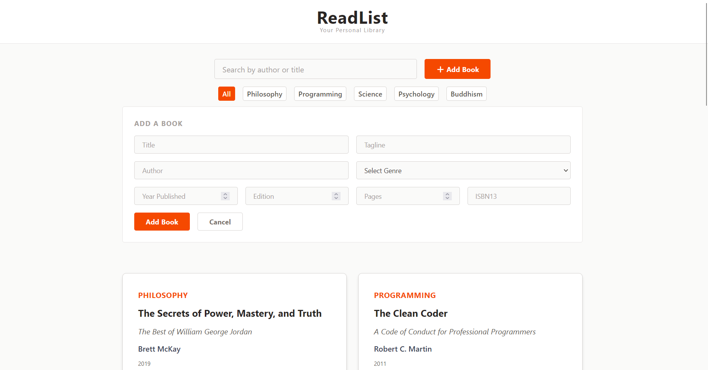

# ReadList — Personal Book Library App

ReadList is a personal book library app for organizing, browsing, and managing your reading collection. The project is built with React and Tailwind CSS as a component-based single-page application powered by Vite. All content is managed through a local dataset, making the app lightweight and easy to extend.

## Contributor 
Isaac Ndungu

## Project Brief

ReadList is a component-driven book management app designed to make organizing a personal library simple and enjoyable. The app brings together book details, genre filtering, and search in one clean, consistent interface.

## Core Features

### Book Library
- Grid display of all books with title, tagline, author, genre, year, pages, edition, and ISBN
- Genre color-coded labels on each card

### Search & Filter
- Live search by title or author
- Genre filter buttons derived dynamically from the dataset
- Search and filter work together simultaneously

### Add & Delete
- Add new books via a form capturing all fields — title, tagline, author, genre, year, edition, pages, and ISBN13
- Remove any book from the library with a delete button on each card
- New genres added through the form automatically appear in the filter bar

### Header & Footer
- Clean header with the app name and subtitle
- Sticky footer that always sits at the bottom of the page

## Technologies Used

- React 
- Tailwind CSS
- Vite
- Font Awesome
- JavaScript (ES6+)

## Usage Instructions

1. Clone the repository
```bash
git@github.com:isaac-ndungu/library.git
``` 

2. Install dependencies
```bash
npm install
```

3. Start the development server
```bash
npm run dev
```

4. Open your browser and navigate to `http://localhost:5173`


## Screenshots


## Future Improvements

- Reading status tracking — Want to Read, Currently Reading Finished
- Star ratings per book
- Sort by title, author, year, or pages
- Export library as CSV or JSON